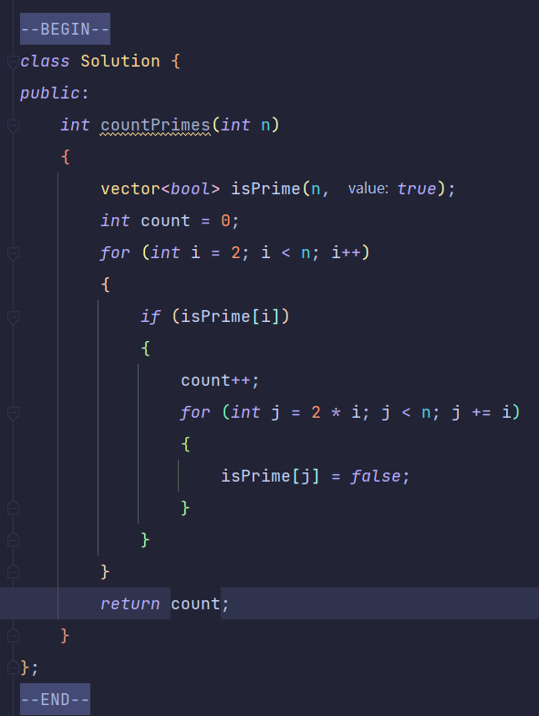

## 埃氏筛选法

🚀️ 用例1：计数质数，对于已经找到的素数，将其倍数标记为合数，当遍历到这些合数的时候不再进行素数的判断，直接跳过

* 未优化做法
* 
* 优化做法：将第二层循环中初始化处改为i * i，因为每次都从2开始势必会造成重复的操作，例如传入的i为2时，会标记2 * 2， 2 * 3， ... ，传入的i为3是，会标记3 * 2，3 * 3，3 * 4...，传入的i为4时会计算4 * 2， 4 * 3， 4 * 4，显然在i * i之前的都在之前的循环中被标记过，所以只需要从i * i开始标记即可

> 注意：修改为i * i以后要注意类型，应该为长整型避免i * i导致溢出
