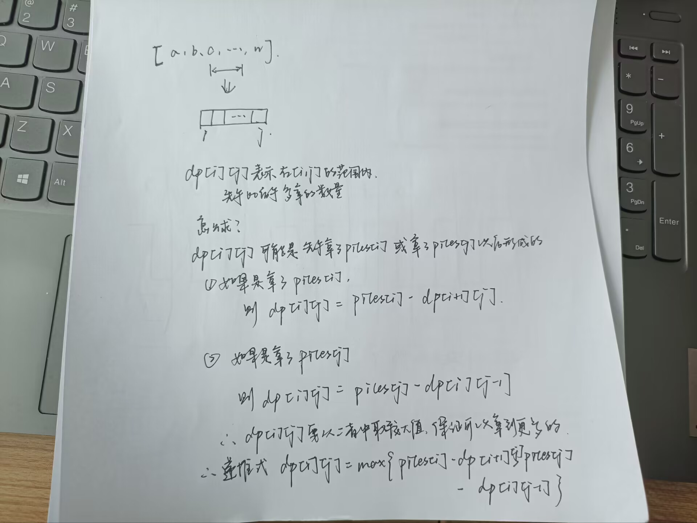

## 数学方法

* 最开始的思路是贪心，每次选择数组开头或者结尾中较大者，这个办法可以通过一个反例来证明无法必赢
  * 如`[2, 7, 5, 1]`，如果根据贪心算法，2和1中选择1，此时数组变化为`[7, 5, 1]`，此时对方可以选择7，数组变化为`[5, 1]`此时我方继续选择较大值5，那么数组只剩下了`1`，对方选择了1，那么我方的总数为7，而对方的总数为8，对方获胜，但是如果我方先拿1，我方就能赢。
  * 所以不应该只是考虑每次我怎么选到最大的，还要考虑怎么让对方选不到大的，所有会有动态规划的感觉，需要全局考虑，毕竟数组对于游戏双方都是不透明的。
* 具体思路：因为这个游戏是轮流来的，一次只能一个人取，而且还只有两个玩家，所以可以联想到01，又由01考虑到奇偶性，因为数组的大小是偶数个元素，而且石子总数是奇数，那么可以进而可以想到数组中奇数位置的元素相加和偶数元素位置相加，二者必然存在一个大一个小，所以问题就变成了求出奇数位置的元素和偶数位置的元素的元素之和，比较哪一个大，然后让先手的去拿奇数位置或者偶数位置的元素，拿到最后必然是先手赢，这就是游戏策略
* 举个例子：`[1, 1, 3, 4]` 先不考虑数组下标从0开始，我们假设四个元素的下标分别是1，2， 3， 4，那么计算奇数和偶数位置的元素之和，发现是偶数位置的元素之和大，所以先手就拿偶数位置的，拿完4以后，数组变为`[1, 1, 3]`  ，此时另一个玩家只能拿1或者3，1和3都是奇数位置的，所以最后拿完是先手玩家获胜。主要是元素个数是偶数，所以下标第一个是奇数，下标最后一个是偶数，天然地决定了玩家必然每次只能从奇数位置和偶数位置取石子堆。
* 能够总结的东西：没什么可以总结的，主要就是从只有两个玩家，发散思维想到0和1，奇数和偶数之间的关系。


## 动态规划方法

* 思路：
* 具体实现，因为根据定义，`j > i` ， 所以只要让`i` 从`n - 2`开始递减，让`j` 从`i + 1`开始，不断计算出`dp[i][j]`即可
* 需要补充的一点是，初始化的方法为
  ```
  for (int i = 0; i < n; i++) 
  {
      dp[i][i] = piles[i]; // 因为dp[i][i]表示第i堆到第i堆双方拿的石子最大插值，因为i到i只有一堆，所以谁拿谁就赢了
  }
  ```
